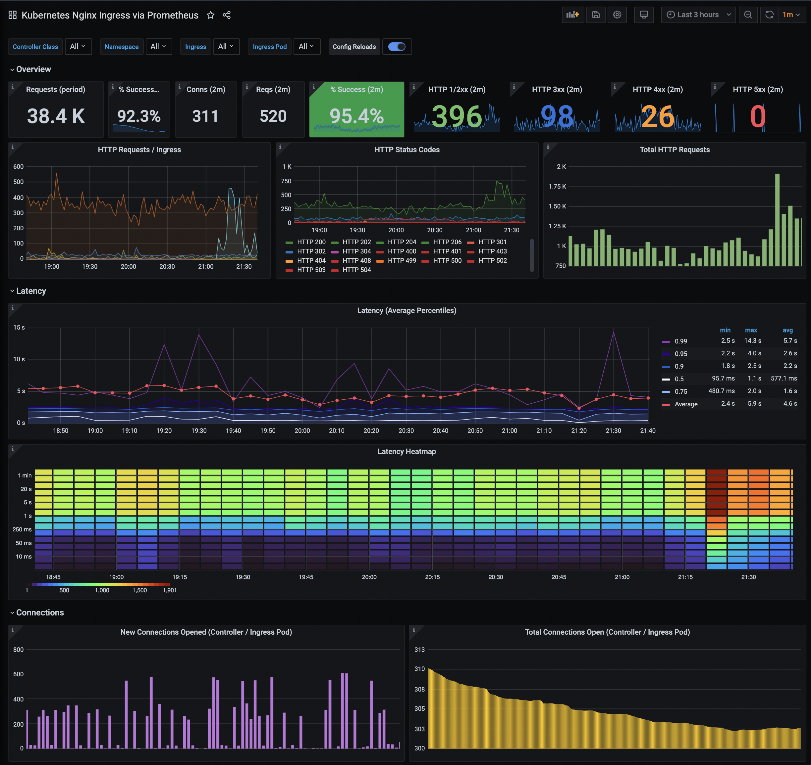

# Grafana Dashboards - DevOps Nirvana
A variety of open-source Grafana dashboards, typically for AWS and Kubernetes

Author: Farley - farley _at_ neonsurge **dot** com

## Description / Overview

### Kubernetes - Nginx Ingress via Prometheus Metrics

If you are using [Nginx Ingress](https://github.com/kubernetes/ingress-nginx) (which you should be) and [Prometheus](https://prometheus.io/) (which you also should be) this dashboard is what you wish you had years ago.

This was created after much frustration from lack-of-visibility with the currently available open source dashboards.  It's loosely based on a number of other dashboards including the [official Grafana Dashboards for Nginx Ingress](https://github.com/kubernetes/ingress-nginx/tree/master/deploy/grafana/dashboards).  This dashboard largely replaces the need for any/all other ingress dashboard.  This is a ~20th generation dashboard at this time, having been iterated and iterated upon with every usage of it.

Highlights:
* This dashboard is an beautiful visual heartbeat of your system.
* Top middle center is a green-backed "Percentage Success" which changes color as the reliability decreases.
* The top row instantly gives you overall and "now" (last 2 min) insights into your traffic usage
* The next row gives you some insights of the traffic and status codes
* You then have some beautiful latency percentiles and averages and heatmap
* And finally connection counts (note: connection counts are not tallied per-ingress, only per-controller).
* Similar to the [official Dashboards](https://github.com/kubernetes/ingress-nginx/tree/master/deploy/grafana/dashboards), the graphs show the Config Reloads
* Click on the various status codes to hide all other status codes and get an insight into the one status code you wish to view the graph on.
* Hover over graphs on the top-left HTTP Requests / Ingress graph to find out which ingresses have which traffic loads.
* Change the variables such as namespace, or ingress above to dive into your various services and get more direct insight on only those service(s).
* Is _more_ future-friendly than the [official Dashboard](https://github.com/kubernetes/ingress-nginx/tree/master/deploy/grafana/dashboards) by supporting the new multi-namespace feature Nginx Ingress by allowing you to choose the namespace of the **ingress**, not of the controller.

## What is DevOps Nirvana?

DevOps Nirvana is an ideal on top of the DevOps principles implementing a set of best-practices, automation, and standards.  For more information, contact the author or see [devops-nirvana.com (coming soon)](https://devops-nirvana.com)
